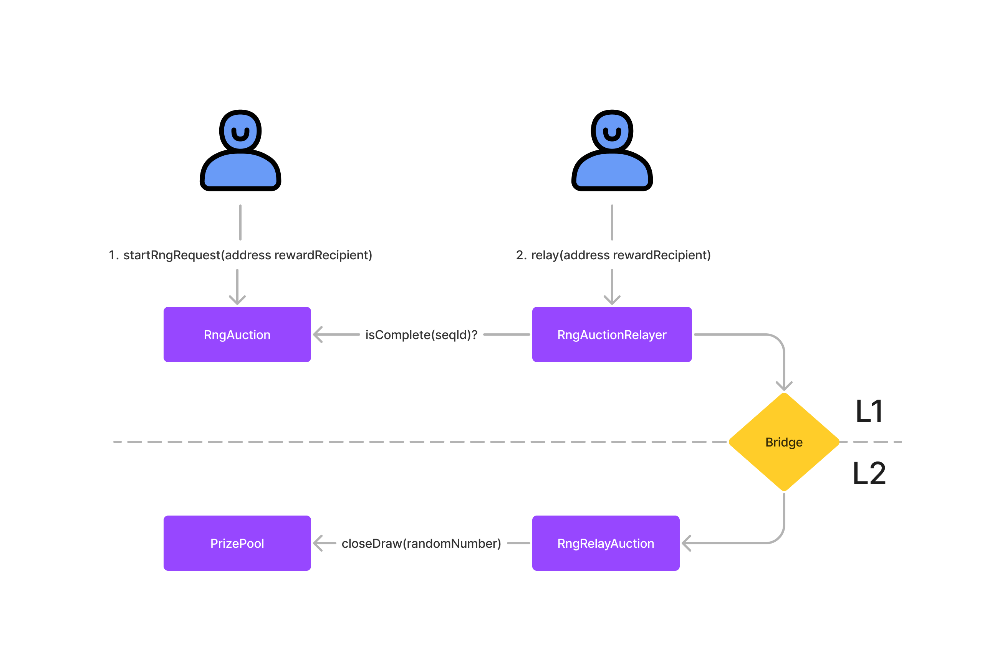

<p align="center">
  <a href="https://github.com/pooltogether/pooltogether--brand-assets">
    
  </a>
</p>

# PoolTogether V5 Draw Auction

[](https://github.com/generationsoftware/pt-v5-draw-auction/actions/workflows/coverage.yml)
[](https://docs.openzeppelin.com/)


<strong>Have questions or want the latest news?</strong>
<br/>Join the PoolTogether Discord or follow us on Twitter:

[](https://pooltogether.com/discord)
[](https://twitter.com/PoolTogether_)

## Overview

The Draw Auction is a suite of contracts that auctions off the transactions required to push a new random number to the Prize Pool.

PoolTogether V5 Prize Pools have periodic Draws. A "Draw" is when a random number is used to distribute the next batch of prizes to the users. This means that an external contract must source a random number and push the random number to the Prize Pool.

To incentivize new draws, each Prize Pool holds a reserve of tokens. A privileged "draw manager" is allowed to push random numbers to the Prize Pool and withdraw from the reserve.

The Draw Auction serves as the draw manager for all Prize Pools.

## How it Works

Random numbers come from an RNG service on Ethereum, and Prize Pools live on L2s. This means that we need to incentivize a sequence of transactions to generate a new random number on Ethereum, then bridge it to the Prize Pool on L2.

Each sequence includes two auctions:

1. Starting the RNG request. This is when the RNG request kicks-off, and may require funds (the Chainlink VRF 2.0 needs LINK tokens).
2. Relaying the RNG results to L2 via a bridge.

Starting the RNG request occurs on L1, and receiving the bridge RNG result occurs on L2. The auctions don't have pricing data, so they compute the reward _as a fraction of the available Prize Pool reserve_. This means that the auction on L1 does not need to know how much reserve is available in a Prize Pool on L2.

There are three key contracts:

- RngAuction: auctions off the initial RNG request
- RngAuctionRelayer: relays the RNG results to the RngRelayAuction
- RngRelayAuction: incentivizes the relay with an auction and triggers close draw on the Prize Pool

For more information, see the detailed [PoolTogether V5 Draw Auction documentation](https://dev.pooltogether.com/protocol/next/design/draw-auction)

## Flow



## Development

### Installation

You may have to install the following tools to use this repository:

- [Foundry](https://github.com/foundry-rs/foundry) to compile and test contracts
- [direnv](https://direnv.net/) to handle environment variables
- [lcov](https://github.com/linux-test-project/lcov) to generate the code coverage report

Install dependencies:

```
npm i
```

### Env

Copy `.envrc.example` and write down the env variables needed to run this project.

```
cp .envrc.example .envrc
```

Once your env variables are setup, load them with:

```
direnv allow
```

### Compile

Run the following command to compile the contracts:

```
npm run compile
```

### Coverage

Forge is used for coverage, run it with:

```
npm run coverage
```

You can then consult the report by opening `coverage/index.html`:

```
open coverage/index.html
```

### Code quality

[Husky](https://typicode.github.io/husky/#/) is used to run [lint-staged](https://github.com/okonet/lint-staged) and tests when committing.

[Prettier](https://prettier.io) is used to format TypeScript and Solidity code. Use it by running:

```
npm run format
```

[Solhint](https://protofire.github.io/solhint/) is used to lint Solidity files. Run it with:

```
npm run hint
```

### CI

A default Github Actions workflow is setup to execute on push and pull request.

It will build the contracts and run the test coverage.

You can modify it here: [.github/workflows/coverage.yml](.github/workflows/coverage.yml)

For the coverage to work, you will need to setup the `MAINNET_RPC_URL` repository secret in the settings of your Github repository.
